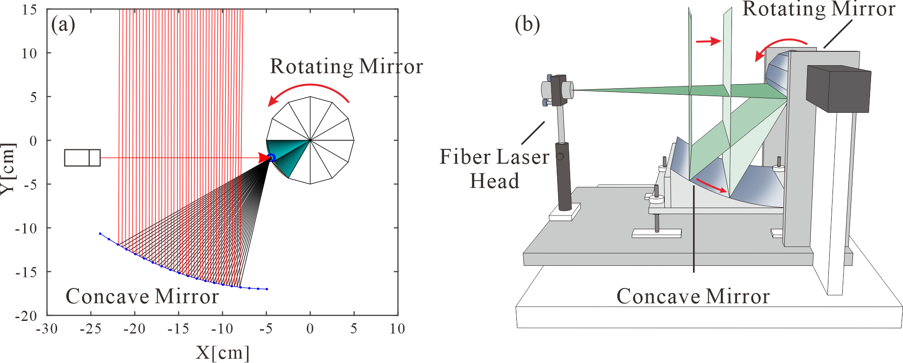
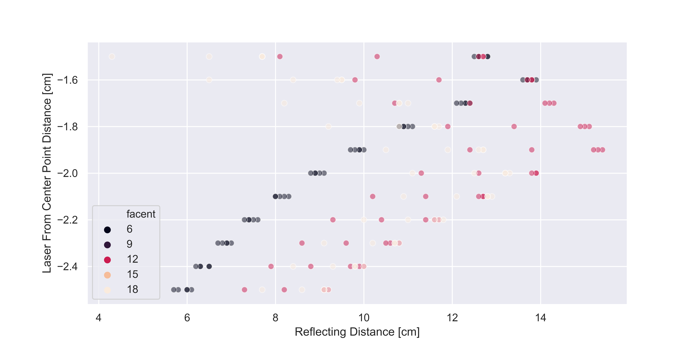
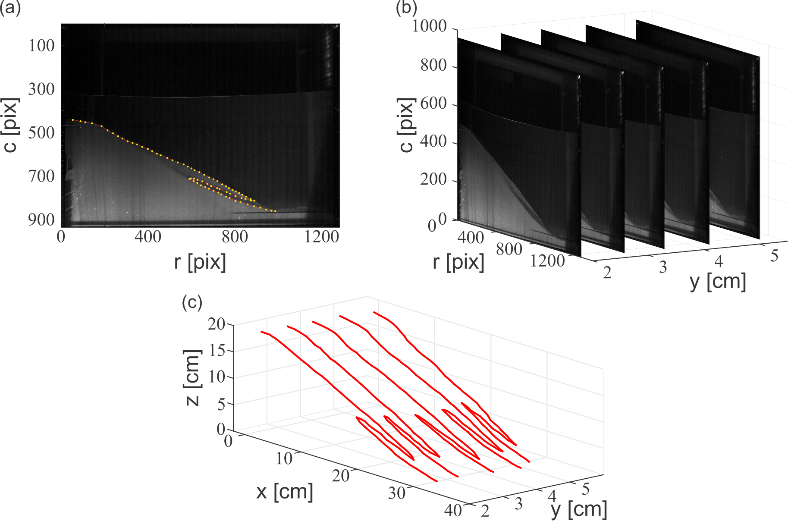
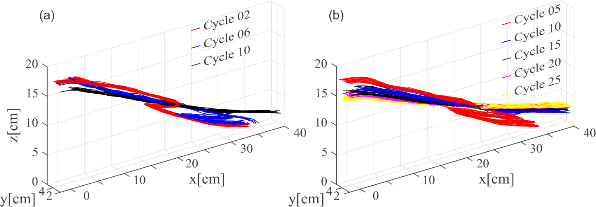

# RotatingMirror
In order to caculate the maximum distance that the laser profile can move, the rotating mirror group and the concave mirror are designed to reflect the laser sheet and form dynamically moving parallel laser profile after two times of reflections.

a. `RotatingMirror.ipynb`
This python script is writen to show the design thinking. Three adjustment parameters are set which are the amount of glasses in the rotating mirror group (facent), radius (rotatingR) of the rotating mirror and the distance below the center of the rotating mirror group (Laserdist) respectively.

b. `RotatingFunction.ipynb`
This python script is writen to find the best combination to construct the whole physical mechanism. The best reslut of the maximum distance is shown below. There would be the maximun reflecting distiance around 15cm when the facent of rotating mirror is 12 and the distance below the center of the rotating mirror group (Laserdist) is around 1.9 cm.

